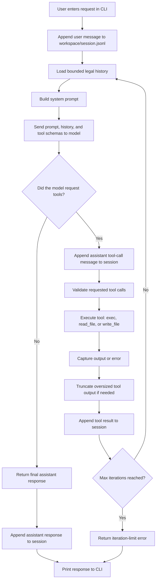

# MOTE

**MOTE** is a tiny, local, persistent, tool-using personal agent runtime.

It is designed to sit in the narrow space between:
- a 50-line toy agent that collapses in real use, and
- a full platform/framework that hides the engine under layers of infrastructure.

MOTE keeps the core loop visible:

1. take a user message
2. call the model
3. execute requested tools
4. append tool results
5. repeat until the model returns a final answer
6. persist the turn locally

The goal is not to be a platform. The goal is to be the **smallest stable personal agent runtime** that still feels alive.

## Design goals

- **Single-user first**
- **Local-first**
- **Persistent across turns**
- **Tool-calling at the center**
- **Small enough to understand in one sitting**
- **Stable enough for daily CLI use**
- **Easy to inspect, modify, and extend**

## What MOTE includes

Canonical MOTE v1 intentionally includes only:

- one CLI
- one workspace
- one persistent session file
- one provider wrapper
- one minimal prompt builder
- one recursive agent loop
- three tools:
  - `exec`
  - `read_file`
  - `write_file`

## What MOTE does not include

To preserve clarity, MOTE v1 does **not** include:

- chat platform integrations
- cron / heartbeat services
- MCP
- plugin marketplaces
- multi-tenant architecture
- message buses
- complex provider abstractions
- background orchestration

## Repository layout

```text
MOTE/
├── README.md
├── AGENTS.md
├── requirements.txt
├── .gitignore
├── config.py
├── tools.py
├── session.py
├── prompt.py
├── provider.py
├── loop.py
└── main.py
```

## Architecture



MOTE is organized around a visible recursive loop: receive input, call the model, execute tools when requested, append results, and continue until the model returns a final answer. The workspace session file preserves continuity across turns, while legal history trimming reduces the chance of replaying orphaned tool results.

## Safety model

MOTE v1 is intentionally minimal, but it still includes a few practical guardrails:

- shell commands have a timeout
- oversized tool output is truncated
- file reads/writes are anchored to the workspace
- path traversal outside the workspace is denied
- obvious destructive shell patterns are blocked
- tool-call turns handle `None` assistant content safely
- history replay is trimmed at legal boundaries to reduce orphaned tool-result issues

These are not enterprise guardrails. They are the minimum viable bolts that keep the runtime from collapsing under normal use.

## Quick start

### 1. Clone the repo

```bash
git clone https://github.com/SOPHY-AGI/MOTE.git
cd MOTE
```

### 2. Install dependencies

```bash
pip install -r requirements.txt
```

### 3. Set your API key

```bash
export OPENAI_API_KEY="your_api_key_here"
```

Optional environment variables:

```bash
export MOTE_WORKSPACE="./workspace"
export MOTE_MODEL="gpt-5-mini"
```

To target a local OpenAI-compatible backend instead of OpenAI directly:

```bash
export MOTE_BASE_URL="http://localhost:8000/v1"
export MOTE_MODEL="your-local-model"
export OPENAI_API_KEY="no-key"
```

### 4. Run MOTE

```bash
python main.py
```

## Example interaction

```text
USER > list the files in the workspace
  [mote] ⚙️  exec({"cmd": "ls"})

MOTE > I found the following files in the workspace: ...
```

## Why MOTE exists

A lot of agent code falls into one of two traps:

- **too small to survive reality**
- **too large to understand clearly**

MOTE is an attempt to sit exactly in the middle.

It should be possible to read this codebase in under ten minutes and understand how a real tool-using agent works from top to bottom.

## Extension philosophy

Nothing new should enter MOTE unless it strengthens the runtime **without hiding the loop**.

Good future additions might include:
- optional web search
- optional reminders
- one optional remote/chat interface
- one optional local OpenAI-compatible model backend

But only if the core remains visible.

## One-sentence summary

**MOTE is a tiny, local, persistent personal agent whose entire architecture is organized around making the core agent loop understandable, stable, and beautiful.**
